# Elastic Load Balancer

AWSには以下の種類のロードバランサー（以下、LB）が存在する。

## LBの種類

### ALB - Application Load Balancer -

L7（アプリケーション）で動作するLB。
HTTPやHTTPSなどのプロトコルで振り分けすることができる。

分散アルゴリズムが不明

このLBにはヘルスチェック機能を持っている。  
このLBがヘルスチェックで異常がLBの閾値を超えた場合、以下の手順でタスクをkillする。

- initial: 初期起動状態
- healthy: 正常な状態
- unhealthy: 異常度が閾値未満
- draining: 異常値が閾値を超えたため、バランシング対象から切り離し

### NLB - Network Load Balancer -

L4（ネットワーク）で動作するロードバランサー。  
TCPプロトコルしか喋れないので、API-GWなどのヘルスチェックは行えない。  
そのため

- healthy: 正常な状態
- unhealthy: 異常度が閾値未満
- draining: 異常値が閾値を超えたため、バランシング対象から切り離し

### CLB - Classic Load Balancer -

使うな

**使　う　な**

## 負荷分散アルゴリズム

負荷分散アルゴリズムは以下の種類が存在する。

### DNS Round Robin

各種ELBが自身のEndPointを決定する際に用いられる分散アルゴリズム。  
ホストがDNSから名前を引いて通信対象のIPアドレスを決定する際に、分散候補のいずれかのIPアドレスを返すことで負荷分散を実現する。  
しかし、これはホスト側がDNSキャッシュを有効にしていると同じEndPointへ通信するため負荷に偏りが生じる。

性能試験などを行う場合は、できるだけDNSキャッシュを無効もしくはキャッシュ破棄サイクルを早めておいたほうがいいかもしれない。

> DNSキャッシュ  
> ホストがDNS情報をローカルにキャッシュして、それを用いてアクセスすることで高速なアクセスを実現する方法。  
> DNSを引く処理を短絡するため、Round Robinの負荷分散に偏りを与える可能性がある。

### Flow Hash

ELBがTargetGroupへ通信する際に用いられる分散アルゴリズム。  
通信を掛ける際に以下の要素をハッシュ計算して決定する。

- Src IP
- Src Port
- Dst IP
- Dst Port
- Protocol

これは、同じリソースからの通信は同じリソースに割り当てるというキャッシュ思想の負荷分散方式である。  
よって、性能試験などの同じリソースから膨大な数のリクエストを通信する場合は偏りが発生してしまう。

### 最小
