# スイッチロール

他アカウントからのログインを許可するロールのこと。

## ネットワーク図



## やり方

登場人物を整理しておく。

- アカウントA  
  アカウントBによってリソースを制御されたいアカウント。
  - アカウントID: `aaa...`
- アカウントB  
  アカウントAのリソースを制御したいアカウント
  - アカウントID: `bbb...`

### アカウントAでやりたいことのロールを作る

> 作成するロール情報
>
> - ロール名: `call-api-for-B`
> - ARN: `arn:aws:iam::aaa...:role/call-api-for-B`

まずは外部アカウントが使う用のロールを作る。  
【信頼されたエンティティの種類の選択】を「別のAWSアカウント」にする。

- アカウントID: bbb...
- オプション
  - [ ] 外部IDが必要
  - [ ] MFAが必要

ポリシーには、必要なことを最小限で構築したインラインポリシーが良い。  

これで、アカウントBからのSTS呼び出し経路ができた。

### アカウントBでスイッチ用のロールを作る

> 作成するロール情報
>
> - ロール名: `call-api-of-A`
> - ARN: `arn:aws:iam::bbb..:role/call-api-of-A`

アカウントBで`call-api-for-B`を使うためのロール`call-api-of-A`を作成する。

```json
{
  "statement": [
    {
      "Effect": "Allow",
      "Action": "sts:AssumeRole",
      "Resource": "arn:aws:iam:xxxxxxxxxx:role/call-api-for-other"
    }
  ]
}
```

`sts::AssumeRole`とはSTSを使って一時的にロールの有効化を要求するアクションである。  
これで、アカウントAへのSTS呼び出し経路ができた。

以上二つの作業により、権限上の話ではあるが  
AはBからのSTSコールを受け付け、  
BはAへのSTSコールが可能となった。

### スイッチロールしたいユーザーに紐づけ

これまでの作業はあくまで権限上の経路を作ったに過ぎない。  
実際に権限を使うためにユーザーへ付与する。

アカウントBのユーザーAへ`call-api-of-A`のロールを紐づける。  
これで、アカウントBのユーザーAはアカウントAへスイッチロールの要求が出せるようになった。

### スイッチロールする

アカウントBのユーザーAでログインしておく。

スイッチロールには、成り代わりたいアカウントAの以下の情報が要求される。

- アカウント:`aaa...`  
- ロール: `arn:aws:iam::aaa...:role/call-api-for-B`

> システムで解決できそうな面倒くささがある。  
> このユーザーAには`sts:AssumeRole`の権限が付いていることから、スイッチ先のアカウントもロールARNも分かっているハズである。  
> プルダウンか何かで選ばせてくれもいい気がする。
