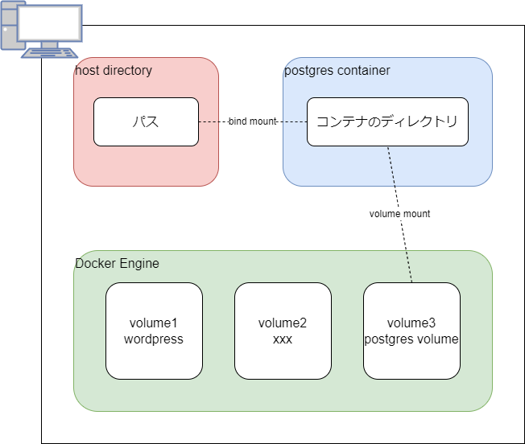

# Volume

Dockerにおけるファイル永続化は２種類

- bind mount
- volume mount



---

## Bind Mount

Dockerホストのファイルシステムの一部に直接ファイルを保存方法。  
Dockerfileでは制御できないので、docker-composeファイルもしくはコマンドオプションで対応する。

```console
$ docker container run --name test -it --rm --mount type=bind,src=$HOME,dst=/usr/share/host ubuntu:latest bash
```

> `--mount`オプションはDocker17からサポートされた  
> `-v`オプションは極力使わないように書いていく

```yaml
version: '3.1'
services:
  db:
    volumes:
      - type: bind
        source: $HOME
        target: /usr/share/host
```

---

## Volume Mount

Dockerのデータ領域の中にファイルを保存する方法。  

docker volumeの構築

```console
$ docker volume create test-volume
test-volume
```

docker containerにマウント指示

```console
$ docker container run --name test -it --rm --mount type=volume,src=test-volume,dst=/usr/share/host ubuntu:latest bash
```

### Dockerのデータ領域とは？

「Dockerのデータ領域の中に」などと大袈裟に言っているが、結局はホストのファイルシステムのどこかに保存しないと永続化できない。  
コマンドでパスを確認すると、`/var/lib/docker/volumes`下にボリューム名のディレクトリが切られていて中に保存されているのが確認できる。

```console
$ docker volume inspect test-volume
[
    {
        "CreatedAt": "2023-01-05T09:19:19Z",
        "Driver": "local",
        "Labels": {},
        "Mountpoint": "/var/lib/docker/volumes/test-volume/_data",
        "Name": "test-volume",
        "Options": {},
        "Scope": "local"
    }
]
```

#### Windowsの場合

WindowsのDocker Desktop(WSL2)の場合、`/var/lib/docker`なるパスは存在しない。

```console
$ ll /var/lib | grep docker
drwxr-xr-x  2 root      root      4.0K 22-10-10 21:06:48 docker-desktop/
```

Windowsのファイルシステムから`/var/lib/docker/`は`\\wsl.localhost\docker-desktop-data\data\docker\volumes`にマップされている。  
WSL2上のLinuxから見る方法はない模様。  
DockerDesktopはWSL上のLinuxからはdockerとして見えているので、docker経由では確認出来る。

```console
$ docker volume ls
DRIVER    VOLUME NAME
local     test-volume
```
