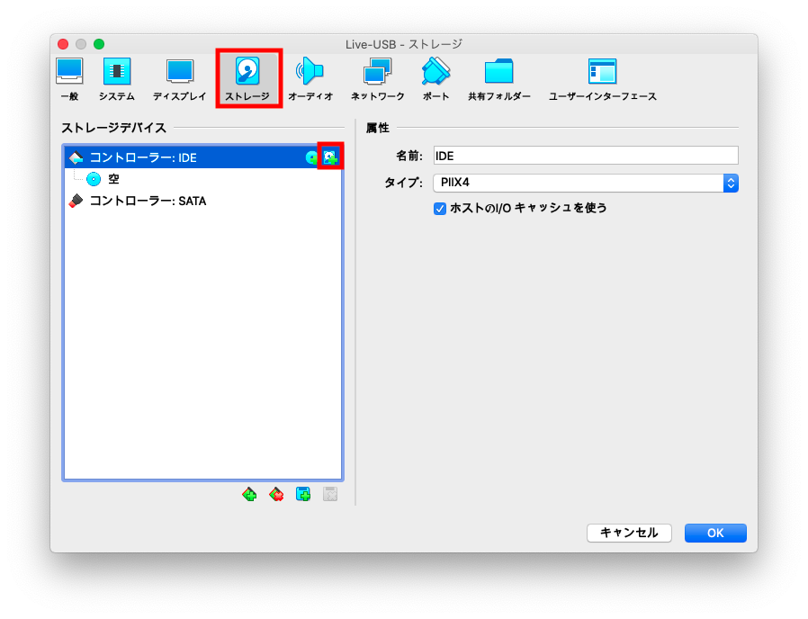

# Live-USB

Live−USBというのはUSBにOSを入れておいて、それをBIOSから起動させるやり方。  
たとえば、リモートワーク用のOSなどがそれで配布されたりする。  
しかし、BIOSから特殊なOSをブートするのはHWの相性などで動かない可能性が高い。  


参考：[VirtualBoxでUSBメモリからブート](https://forzandoblog.wordpress.com/2016/08/01/virtualbox%E3%81%A7usb%E3%83%89%E3%83%A9%E3%82%A4%E3%83%96%E3%81%8B%E3%82%89%E3%83%96%E3%83%BC%E3%83%88/)

## VirtualBoxでのLive-USB(MacOS編)

### デバイスの認識を確認

Live-USBデバイスをMacに認識させよう。  
何のデバイスとして認識したかを確認する。

``` bash
$ diskutil list
/dev/disk0
... ... ...
... ...
...
```

> GUIから行う場合は`ディスクユーティリティ`を使用する。

### VirtualBoxのインスタンスを作成する

必ず空のドライブを持ったインスタンスを作成しておく。

### Live-USBをRAW DISCとして書き出す

`/dev/xxx`をRAW DISCとしてLiveUSB.vmdkの名前で書き出す。

``` bash
$ sudo VBoxManage internalcommands createrawvmdk -filename ~/VirtualBox\ VMs/LiveUSB.vmdk -rawdisk /dev/xxx
```

### VirtualBoxインスタンスをロードする

VirtualBoxをスーパーユーザーで開く。

``` bash
$ sudo /Applications/VirtualBox.app/Contents/MacOS/VirtualBox
```

> Macはアプリケーションが圧縮ファイルになっているから中を辿る必要がある

スーパーユーザーで開くと、一般ユーザーで作ったインスタンスが見えない。  
先程作った`*.vbox`をGUIから追加する。  
【メニューバー】-【仮想マシン】-【追加】

### VirtualBoxインスタンスに紐付ける

ストレージ情報からコントローラに追加する。

> root権限がなかった場合、Permission Deniedのエラーになってしまう。



