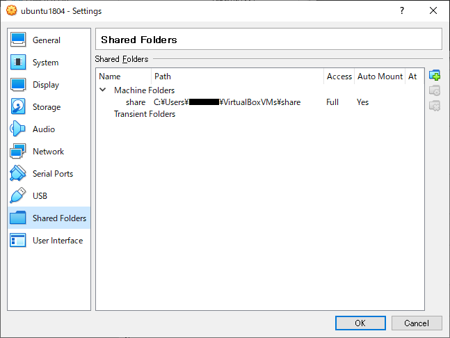

# 環境

Windows10 <--(Virtualbox6.0)--> ubuntu18.04

## Virtualbox側の設定

[Machine]-[Settings]-[Shared Folders]-[Add Share]



### Folder Path

ホスト側の**ディレクトリパス**を指定する。  

### Folder Name

ゲスト側の**ディレクトリ名**を指定する。

### Read-only

何が何でも読み込みだけにするオプション。  
ゲスト側からの書き込みアクセスを禁止する。

### Auto-mount

VMインスタンス起動時に自動的にマウントするオプション。  
この設定の有無でマウント先が変わるので注意が必要。

#### 自動マウントする場合のマウントパス

ゲストOSの再起動後に最初に実行される。

`Folder Name`のパラメータがディレクトリ名の一部として扱われる。  
このディレクトリ・グループが`vboxsf`になるため、ユーザーを当グループに割り当てないとアクセスできない。

|設定項目||
|:---:|:--:|
|マウントパス|`/media/sf_$(Folder Name)`|
|アクセス権限|root:vboxsf|

グループへの割り当ては以下のコマンドのいずれかで行う。

- `usermod -aG GROUPS USER`
- `gpasswd -a USER GROUP`
- `adduser USER GROUP`

#### 手動マウントする場合のマウントパス

`Folder Name`のパラメータが、UUIDとして扱われる。  
`/etc/fstab`に以下の行を追加する。

```bash
$(Folder Name) /media/vm_share vboxsf defaults 0 0
```

こっちのやり方は更新時に問題がある。  
いきなり、Virtual Boxの共有設定から`Folder Name`を変更して起動すると、起動エラーを起こしてしまう。  
OS起動時に参照される`/etc/fstab`に書かれているUUIDが認識できなくなったためである。

次の手順で更新すること。

1. VMを起動して`/etc/fstab`の内容を更新する
2. `/etc/fstab`の内容に応じて、VMの共有設定を変更する

> 素直にAuto-mount使えば？？

### Mount point

ゲスト側のマウントポイントを手動指定する。

### Make Permanent

実行中のゲストOSで実行する。

### Machine Folders

通常のディレクトリ。普通はこちらを選択する。

### Transient Folders

> 色々な「一時的な」単語たち  
>
> - `Temporary` 全体の中の一時的な時間軸  
>    「時間の短さ」よりも「一時性」が強調された単語で、時間的には長くても使える。  
> - `Transient` 短期間しか存在しない  
>    今回の`Transient`は**VMが起動している短期間**のみという意味で用いられる。
> - `Transitory` 一過性  
>   これも「時間の短さ」そのものよりも「一過性な性質」を指して用いられる。
> - `momentary` いきなり来ては通り過ぎる  
>    「熱しやすく冷めやすい」みたいに**すぐにいつもの状態の戻る**状況に用いられる。
> - `fleeting` 一時的な感情  
>   「一時の気の迷い」のような一時的な感情を表現する際に用いられる。

こちらは一時フォルダとしてマウントされる。  
通常のフォルダとは違って、**シャットダウン時にすべて削除される**。
