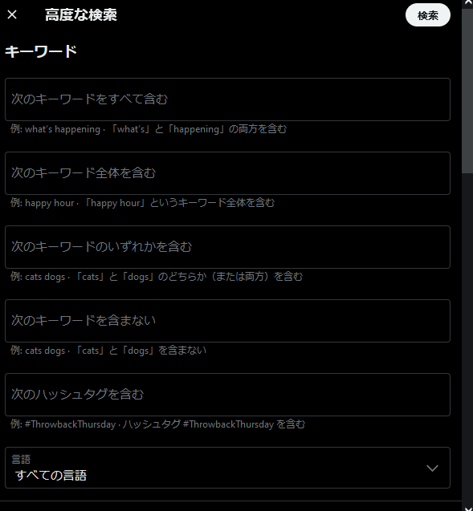

# RESTfulとは？

RESTってURIとHTTPメソッドで動き方が変わるだけでしょ？ｗｗｗ  
このままじゃダメな気がする。

## リソース単位

一般的にAPIと聞けば、LSUDsもイメージが強い。  
そのため、DBを抽象化したAPIを作りたくなる。  
でも、1API = 1Tableという訳ではない。

1リソースとは、利用者の要求を満たすデータ単位である。  
1画面の表示に必要なデータの集合体もリソースといえる。

それでは、それを「誰に提供するか」を軸に見ていこう。

### LSUDs

Large Set of Unknown Developers

不特定多数のユーザーに提供するAPIのこと。

> ex)  
> Facebook API, Twitter API, AWS API

ユーザーの要求に最適化したAPIを実装することは不可能。  
よって、データの種類別インエンドポイントを定義することが多い。

- `/api/v1/users/`
- `/api/v1/users/<int:userID>`

用途が多岐にわたりすぎて最適化はムリゲー。  
最低限の要求には答えられるようにAPIの数を多くしたり、フィールド指定やソート指定などの細かいオプションを用意してカバーしている。  
[`https://twitter.com/search?q=MSFT Dow -Downie&src=typed_query`](https://twitter.com/search?q=MSFT%20%22Dow%22%20-Downie&src=typed_query)  
  

APIのアクセス数を減らして、利便性を上げるために関連するデータを一緒に返すこともできる。  
ユーザーのユースケースに沿った設計にすることで、APIアクセス数を減らしてサーバーを守る。  

### SSKDs

Small Set of Known Developers

特定のシステムのみで利用する専用API。  

> ex)  
> 自社サービス、社内システム

用途が決まっているので最適化できる。  
データの種類よりも画面別、アクション別にエンドポイントを定義することができる。

１画面 = １APIや1アクション = 1APIが基本  
無理に１画面 = １APIにする必要は無い。  
サービスの仕様に沿ったAPIを実装するのが大事 of 大事。

> 参考：<https://www.slideshare.net/pospome/rest-api-57207424>  
> 本当？？？普通にフロントエンド側で無数のコールを叩いてたけどな……  
> まぁ、それでも1API = 1Tableではなかったから言いたいことは分かるけど……

仕様が決まっていて必要な情報は決まっているハズなので、取得データに対する細かいオプションが必要なく、要求者に最適化されたデータを返すことが出来る。

### LSUDs -> SSKDsのコンバーターを用意するAWS

AWSは大量のAPIを抱えているが、それをサービス毎（SSKDs）に変換したりもするらしい。  
本当かどうかはさておき、確かに有用な思想である。

## URI設計

よくあるCRUD設計

|メソッド|URI|説明|
|:--:|:--|:--|
|`GET`|`/api/v1/users/`|全ユーザーの取得|
|`POST`|`/api/v1/users/`|新規ユーザーの取得|
|`GET`|`/api/v1/users/<int:UserID>`|任意のUserIDのユーザー取得|
|`PATCH`|`/api/v1/users/<int:UserID>`|任意のUserIDのユーザー変更|
|`DELETE`|`/api/v1/users/<int:UserID>`|任意のUserIDのユーザー削除|

URLとして機能する必要があるので、path parameterはunique、つまりprimary keyである必要がある。  
その他のパラメータはクエリストリングで渡す方がいいだろう。

その他にも

- `GET /api/v1/users/me`: ログインユーザーの情報を取得する
  - これはエイリアスで実装されることがある。実際には内部で`/api/v1/users/10`などがコールされる。
- `GET /api/v1/users/search?name=xxx&age=xxx`: ユーザー検索用API

## レスポンスの設計

### HATEOS

Hypermedia As The Engine Of Application State

レスポンスjsonの中に次に行うべきURIが指定されていること？  
確かに、これだとフロントエンド側で制御することが少なくなる。  
でも、通信料は増えちゃうね。
