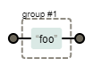
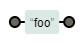
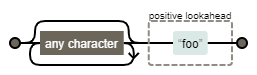
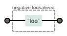
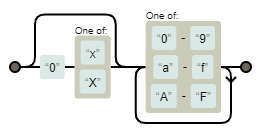

# 正規表現スニペット

## 正規表現忘れないために

おすすめサイト

- [仕様](https://www.regular-expressions.info/reference.html) 公式？
- [Regexper](https://regexper.com/) 正規表現の可視化サイト  
  若干、negative look 系とか画像作れないみたい。
- [Qiita:正規表現あれこれ](https://qiita.com/ikmiyabi/items/12d1127056cdf4f0eea5#%E3%82%AD%E3%83%A3%E3%83%97%E3%83%81%E3%83%A3%E3%81%97%E3%81%AA%E3%81%84%E6%8B%AC%E5%BC%A7)

---

## `capturing group & Back references` vs `non-capturing group`

|        文法         |   書式    |                 図解                  | 意味                                       |
| :-----------------: | :-------: | :-----------------------------------: | :----------------------------------------- |
|   capturing group   |  `(foo)`  |       | foo を１文字として判定する。`$n`で参照可能 |
| non-capturing group | `(?:foo)` |  | foo を１文字として判定する。`$n`で参照不可 |

差は、`Back reference`（検索結果の再利用）できるかどうか。  
`Back reference`する場合は、検索条件を`()`で囲み、置換条件`$n`で使用する。

```vim
:s/(\d)/20($1)/
```

`$1`は検索条件で`()`にマッチした文字列のこと。  
`()`の番号と`$n`の番号は一致するので、複数用いることもできる。

ここで登場する記述に統一は目指していない。  
capturing group と non-capturing group のどちらを使用するべきかは、その状況と記述者の思想に大きく左右されるべきである。

## look ahead / behind

|                 文法                 |    書式    |                  図解                  | 意味                  |
| :----------------------------------: | :--------: | :------------------------------------: | :-------------------- |
| 肯定的先読み<br>positive look ahead  | `(?=foo)`  |   | 直後に foo が**ある** |
| 肯定的後読み<br>positive look behind | `(?<=foo)` |  | 直前に foo が**ある** |
| 否定的先読み<br>negative look ahead  | `(?!foo)`  |   | 直後に foo が**ない** |
| 否定的後読み<br>negative look behind | `(?<!foo)` |  | 直前に foo が**ない** |

正直、この日本語訳にした人は翻訳センス無いよ……。  
文法の言葉の意味より、その効果で覚えようね……。

### より前 / より後ろ

「foo」より前を抜き出す場合は、「全検索＋直後に foo がある」と解釈する。

```
(.*)(?=foo)
```

「foo」より後を抜き出す場合は、「直前に foo がある＋全検索」と解釈する。

```
(?<=foo)(.*)
```

### ピリオド

例えば、ピリオドの後に改行コードを追加したいとしよう。  
単純に`\.`を条件としてしまうと、小数点の`.`の後にも改行コードが挟まれてしまうことになる。  
そこで、**数字で挟まれていない`.`**を対象としたい。  
数字で挟まれていないを解釈するには、**前が数字ではない**に解釈し直す。

```
\.(?!\d)
```

## ASCII 文字列

これ、どのタイミングで使ったんだろう。  
mp3tag で音声ファイルのタグ編集なのは分かってるんだけど

```
\p{ASCII}
[\x00-\x7F]
```

## 数値系

---

### 10 進数

`[0-9]`と`\d`は同じ意味を持つ。

- 基本形  
  `\d+`
- 接頭辞として符号を含むことを許す場合  
  `[+-]?\d+`

### 桁数指定

|   書式    | 意味                |
| :-------: | :------------------ |
|  `\d{m}`  | m 桁の数字          |
| `\d{m,}`  | m 桁以上の数字      |
| `\d{m,n}` | m 桁から n 桁の数字 |

> まるで Python のスライスみたいだぁ（直喩）

### 16 進数

- 基本形  
  `[0-9a-fA-F]+`
- 接頭辞に符号を許可する場合  
  `[+-]?[0-9a-fA-F]+`
- 接頭辞に`0x`などの表記を許可する場合
  `(?:0[xX])?[0-9a-fA-F]+`  
  
  > `0x`や`0X`の有無を一気に判定するため group 機能を使いたいが、capture までしたくないので non-capturing group を使ってるだけ。どちらを用いても問題ない。
