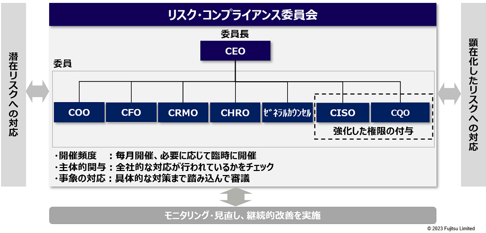

# 「コンビニ交付」システム

2020年5月、富士通Japanの構築したいステム「コンビニ交付」システムで市場障害が発生した。

[当社「コンビニ交付」システムに対するデジタル庁様からのご要請について](https://www.fujitsu.com/jp/group/fjj/about/resources/news/topics/2023/0509-1.html)

## 対応について

- [富士通、相次ぐコンビニ交付サービス不具合に謝罪　「行政サービスへの信頼損ねた」　再発防止策を開示](https://www.itmedia.co.jp/news/articles/2305/19/news202.html)
- [情報セキュリティ対策の強化およびシステム品質改善に向けた当社の取り組みについて](https://pr.fujitsu.com/jp/news/2023/05/19.html)

2023/5/19、富士通Japan製システムで相次いで発生しているコンビニ交付サービスの不具合についての再発防止策が出た。  
具体的には、

- 体制強化
  - 最高品質責任者（CQO）の役職を設け、同社のリスクコンプライアンス委員会にCQOを加える。
  - CQOと最高情報セキュリティ責任者（CISO）にはこれまで以上の権限を与え、品質への具体策を策定する。
  - 同委員会を毎月開催することで、迅速に実行する体制を取る。
- 情報セキュリティ対策強化
  - 客観性の高いリスクは愛（脆弱性を検知する仕組みの整備）と対応
  - セキュリティ統制に関する権限の集中化
  - 現場組織のセキュリティ強化
- システム品質の改善・向上
  - 富士通Japanに対する品質統制の早期権限集中化
  - 住民向けサービスに対する品質統制の恒久対応
  - 品質統制・リスクモニタリングを支える設計・運用基盤の強化

など、色々書かれている。

## この対応は本当によかったのか？

この手の問題は、制度的に規定された説明責任と実践的な知を積み上げる慣習的知性の構築という、駆動論理と時間軸が異なる2者が交差することで複雑になっていく。  
今回続いたこのシステムトラブル問題を、同社がで示した制度やマニュアル整備といった対策を実施することでは、自発性を削いでしまう上に業務が増えてしまうのでますます防げなくなっていく。  
しかし、短期的な軸では説明責任を果たさねばならないのでこういうことをやらないといけない。  
問題からのレジリエンスの高い組織は、日々の実践の中に復旧力を備えているので、アクシデントからの復旧に実践の積み上げが常に伴う。つまり、アカウンタビリティーと実践の時間差が少ない。  
しかし、アクシデントの発生の時に、実践の積み上げという長期的な能力が不足していると、短期のアカウンタビリティーの対応に追われてますます復旧力が下がる。この悪循環を断ち切るには、もっと違う知恵が必要である。

基本的には、人々に厳しいルールを課し、それを遵守させることで問題を起きなくさせる、という設計思想の対応になっている模様。  
ただ、そのやり方は明確に組織論の組織事故研究からは負け戦であることが明白で、より巨大な問題を引き起こすリスクを内包するようになってしまう。  
なぜならば、組織全体が仕組みが問題を防ぐのであって自分たちの実践ではない、だからルールだけ守れば良い、となり、いうなればマインドレスになるから。  
この手の問題は、マインドフルに問題の火種を見つけ、いち早く復旧するというレジリエンスを高めていくことでしか防げない。  
ある意味で防ぎ続ける実践の積み重ねでしか解決しない。
