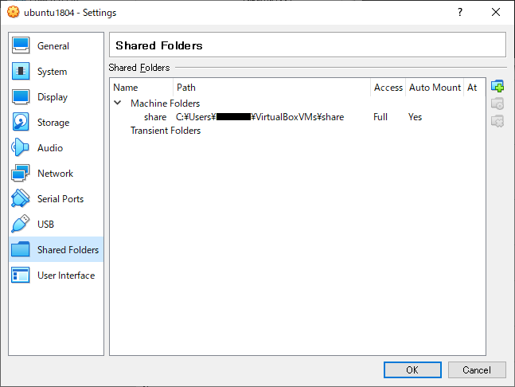

# 環境

Windows10 <--(Virtualbox6.0)--> ubuntu18.04

# Virtualbox側の設定

[Machine]-[Settings]-[Shared Folders]-[Add Share]



## Folder Path

ホスト側の**ディレクトリパス**を指定する。  

## Folder Name

ゲスト側の**ディレクトリ名**を指定する。

## Read-only

何が何でも読み込みだけにするオプション。  
ゲスト側からの書き込みアクセスを禁止する。

## Auto-mount

VMインスタンス起動時に自動的にマウントするオプション。  
この設定の有無でマウント先が変わるので注意が必要。

### 自動マウントする場合のマウントパス

ゲストOSの再起動後に最初に実行される。

`Folder Name`のパラメータがディレクトリ名の一部として扱われる。  
このディレクトリ・グループが`vboxsf`になるため、ユーザーを当グループに割り当てないとアクセスできない。

|設定項目||
|:---:|:--:|
|マウントパス|`/media/sf_$(Folder Path)`|
|アクセス権限|root:vboxsf|

グループへの割り当ては以下のコマンドのいずれかで行う。

- `usermod -aG GROUPS USER`
- `gpasswd -a USER GROUP`
- `adduser USER GROUP`

### 手動マウントする場合のマウントパス

`Folder Name`のパラメータが、UUIDとして扱われる。  
`/etc/fstab`に以下の行を追加する。

```bash:bash
$(Folder Name) /media/vm_share vboxsf defaults 0 0
```

## Mount point

ゲスト側のマウントポイントを手動指定する。

## Make Permanent

実行中のゲストOSで実行する。
