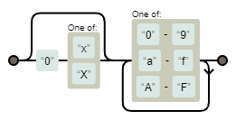

# 正規表現忘れないために

おすすめサイト
- [仕様](https://www.regular-expressions.info/reference.html) 公式？
- [Regexper](https://regexper.com/) 正規表現の可視化サイト
- [Qiita:正規表現あれこれ](https://qiita.com/ikmiyabi/items/12d1127056cdf4f0eea5#%E3%82%AD%E3%83%A3%E3%83%97%E3%83%81%E3%83%A3%E3%81%97%E3%81%AA%E3%81%84%E6%8B%AC%E5%BC%A7)

## `capturing group` vs `non-capturing group`

|文法|書式|意味|
|:--:|:--:|:--|
|capturing group|`(foo)`|fooを１文字として判定する。`$n`で参照可能|
|non-capturing group|`(?:foo)`|fooを１文字として判定する。`$n`で参照不可|

ここで登場する記述に統一は目指していない。  
capturing groupとnon-capturing groupのどちらを使用するべきかは、その状況と記述者の思想に大きく左右されるべきである。

単純に、
- 参照されると問題なときはnon-capturing groupを使え。
- 参照できても問題ないならcapturing groupを使え。

## 検索した表現を再利用する - Capturing group & Back references -

検索条件を`()`で囲み、置換条件`$n`で使用する。

- capture機能 `()`の内の文字列を記憶し、参照できる機能
- group機能 `()`の内の文字列を１文字として扱う機能

```vim
:s/(\d)/20($1)/
```

`$1`は検索条件で`()`にマッチした文字列のこと。  
`()`の番号と`$n`の番号は一致するので、複数用いることもできる。


## より前 / より後ろ - posiive look forward & positive look behind -

「foo」より前を抜き出す場合は`positive look forward`を用いる。

```
(.*)(?=foo)
```

「foo」より後を抜き出す場合は`positive look behind`を用いる。

```
(?<=foo)(.*)
```

## ASCII 文字列

これ、どのタイミングで使ったんだろう。  
mp3tag で音声ファイルのタグ編集なのは分かってるんだけど

```
\p{ASCII}
[\x00-\x7F]
```

## 数値系
---

### 10進数

`[0-9]`と`\d`は同じ意味を持つ。

- 基本形  
  `\d+`
- 接頭辞として符号を含むことを許す場合  
  `[+-]?\d+`

### 桁数指定

m 桁の数字
m 桁以上の数字
m 桁から n 桁の数字

> まるで Python のスライスみたいだぁ（直喩）

```
\d{m}
\d{m,}
\d{m,n}
```

### 16進数

- 基本形  
  `[0-9a-fA-F]+`
- 接頭辞に符号を許可する場合  
  `[+-]?[0-9a-fA-F]+`
- 接頭辞に`0x`などの表記を許可する場合
  `(?:0[xX])?[0-9a-fA-F]+`  
  
  > `0x`や`0X`の有無を一気に判定するためgroup機能を使いたいが、captureまでしたくないのでnon-capturing groupを使ってるだけ。どちらを用いても問題ない。
  
