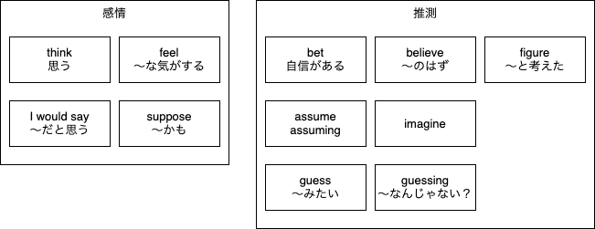

# 思う

## 思うはいつ使うのか

1. 自分が感じたことを伝える時
   - あの映画すごくよかったと思う
   - その髪型すごく似合ってると思う
2. 何かを推測するとき
   - 明日は雨だと思う
   - 二人はわかれたと思う

## 感情の思うを伝える言葉たち

### Think

これは、薄いながらもすでにある知識の上での「思う」になります。

I think that George is planning it.  
「ジョージが企画してると思うよ」

感情の思うは基本的には`think`になります。  
ただし、2の場合でも使える非常に便利な言葉です。

### I would say

I would say he's pretty good looking.  
「私はカッコイイと思うけどな」

かなり主観的な物言いです。  
「個人的には～」や「私からすると～」の意味があります。

### I feel

I feel like he's avoiding me.  
「無視されてると思うんだ」

思うよりも「気がする」が一番しっくりくる訳です。  
I thinkと似たような感じで使うことができます。

### I suppose

I suppose he's pretty good looking.  
「まぁ……カッコイイ……かも？」

思うの意味合いが無い訳ではないですが、かなり薄い表現です。  
少なくとも、今回の例文が**誉め言葉として伝わることはない**でしょう。

## 推測の思うを伝える言葉たち

### bet

betは「お金をかける」の意味があります。  
なので、お金をかけられるほどに自信がある「思う」です。

ほとんど確信がある状態と言っていいでしょう。  
といっても、友人の間柄に使われるなどのかなりカジュアルな表現です。

I bet you did great on the test.  
「テストの点はかなりいいと思うよ」

### believe

I believe that ～  
「確か、～のはず」

thinkより少し強い確信があるときに使われます。  
日本人の感覚では「信じる」の印象が強く、とてもつよい確信と思いがちですが、気軽に使える単語です。

### assume / imagine / guess

- assume : 思い込む・勝手に想定する  
- imagine: 想像する  
- guess  : 当てる  

自信がないとまでは言わないが、軽い感じの「思う」です。  
特に根拠となる情報はないんだけど、そう思っている状態を指します。  
特に何も聞いてないけど、そうなんじゃない？みたいな感じです。  
  
そのため、「責任を負いたくない」ときに使われたりします。  

#### I assume ～ vs I'm assuming ～

特に違いはない  

#### I guess ～ vs I'm guessing ～

若干ニュアンスが変わるので気を付けましょう  

`I'm guessing ～`は「～なんじゃない？」と感覚的に当てるという意味になる。  
`I guess ～`は「～みたいだよ」  

難しいので、会話調にしてみます。  

A: Has Sherry RSVPed to the party yet?  
シェリーからパーティの返事来た？  

> `RSVPed`「招待の返事をする」※フランス語源

B: Not yet. **I'm guessing** she's busy with work  
まだだよ。仕事で忙しいん**じゃないかな**  

A: According to her Facebook, it looks like she's been going out overnight.  
FBを見る限りでは、毎晩遊んでるみたいだけど  

B: Oh, **I guess** she just doesn't want to come then.  
あ、そう。じゃ、来たくないだけ**みたいだね**  

### figure

I figure George is planning it since Megan isn't here anymore.  
メーガンがもういなくなったから、ジョージが企画してると思うよ  

思考した結果の思うを意味します。  

I finally figured out this math problem!!  
やっと数学の問題が解けたよ  

> figure out：問題を解決する  

ように考えた結果、思いに至ったという意味です。  
そのため、何を考えたのかという「理由」が必要になります。  
