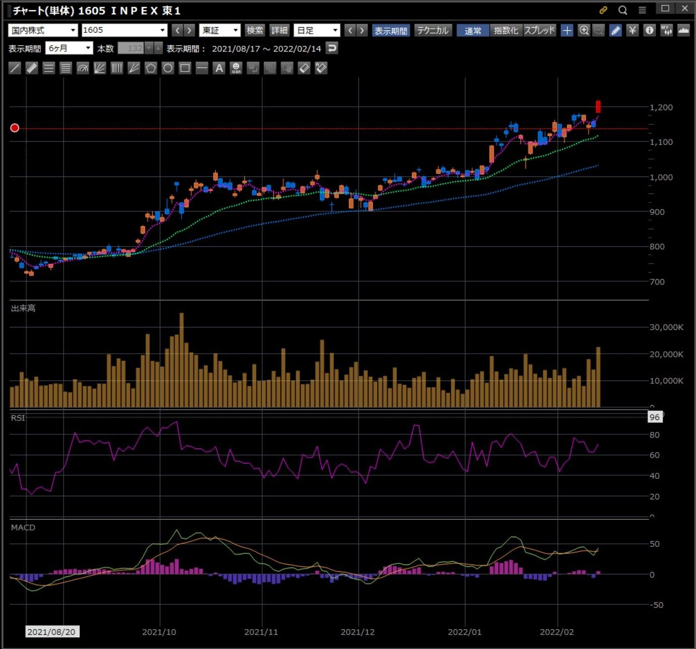
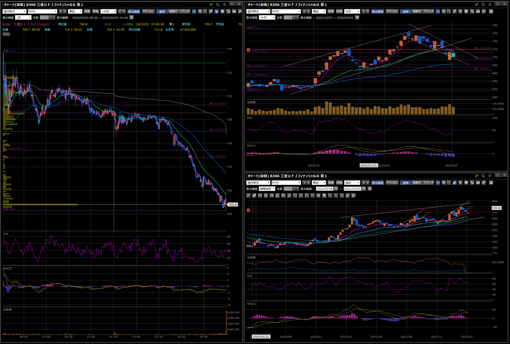
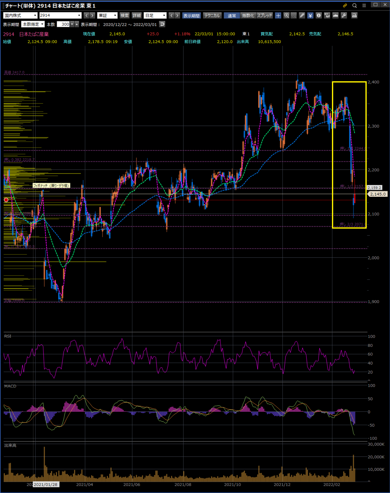

# Tips

## 窓が開いた時の下がり具合

INPEXの上がりに窓が開いた。いくらで逆指値して利益確定するべき？  

Q. そもそも上昇トレンドなのでしない？
A. 正解はさらに伸びた

|2022/02/14|2022/03/01|
|:--:|:--:|
|||

## 指標の味方

## Q. 株はどう売買すればいいの？

【グロース株】

- 良い決算で跳ねた後に買う
- 良い決算が続く限りホールド
- 悪い決算がでた後に売る

【バリュー株】

- 低PERの時に安く買う
- 決算はグロースほど重要ではない
- オールドエコノミーなので一回転(10〜30%)取れたら売る。

## モメンタムって？

2022/03/01、日経平均株価が380円程度上がる中、銀行系（特にUFJ銀行）が下げた。  
１年間上がり調子だったモメンタムが終わり、他の事業なりに目が行き始めたのかもしれない。  
こういうトレンドの終わりをモメンタムと呼ぶこともある。  
今回はそうかもしれないし、違うかもしれない。  
少なくとも、長く上り調子のモノはいつ急落するか分からないので注意

## 急激な下げには原因アリ

### ロシア・ウクライナ問題

この急激な下げについて、よく考える必要がある。  
ロシアの侵略によりロシア・ウクライナ間のJTの生産工場５拠点が操業停止となった。  
この５拠点はJTの純利益の20%を占めている。  
つまり、株価が20%下落しても特別不思議ではないということだ。  
それを予測できたかどうか。

